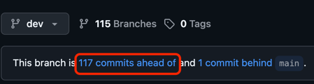

# AutoIcy
Automated Capstone IC tool

# What it is
Filling out an IC for every sprint is an annoying and time consuming process. This tool help you identify your contributions as well as automatically extracting the correct links and compiling everything in a format that can be paste directly into your IC form.

# Instructions
1. Get the data about your commits
 - In github open the page showing the commits differences between the dev branch for this sprint and your main/master/production branch
 - 
 - Expand the page by clicking 'load more' until all commits are shown
 - Save the page as html only.
2. Get the data about your tasks
 - In Tiaga export your project info at settings > Project > Export 
 - 
3. Run AutoIcy
4. Load html and json files from step 1 & 2
5. Join Tasks with commits
 - Select the task name on the left
 - Select the matching commit on the right
 - Push `Join Task with Commit` to create an entry in your contributions listbox on the bottom of the screen.
 - Repeat Step 5 until you have identified all your contributions for this IC
6. Export your IC data
 - Push `Export to CSV`
 - Open *export.cvs* in your spreadsheet program
 - Copy the first block into columns A & B of your IC report. This is you task link and task number.
 - Copy the second block into columns E & F of your IC report. This is your github commit link and the date it was committed.
 - Manually fill in columns C (complete?), D (coding task?), and G (% of work committed)
7. Check it over
